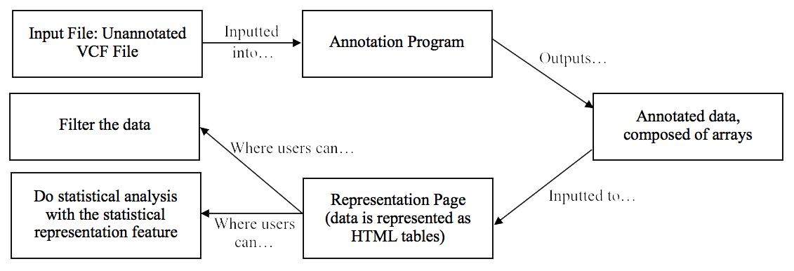

# IHPC NUH Genome Visualisation Project

A school project I did in 2017 to 2018 collaboration with IHPC NUH to visualise genome sequences from raw VCF files to aid doctors in detection and research of gene mutations. The project works as described below.

Please see [this PDF document](./Report.pdf) for more details. Only selected, non sensitive, pieces of code is available in this repository as this project deals with medical data. If more information is needed, feel free to contact me at nigelpjk@gmail.com
